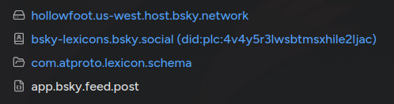

# Resolving Lexicons

Lexicons are actually stored as [Records](../repo/record.md) under the `com.atproto.lexicon.schema` [collection](../repo/collection.md). Each lexicon has the record key of the lexicon's NSID.

The **repository** of the lexicon (where it's stored) is determined by doing a DNS `TXT` lookup of the parent of the lexicon's NSID reversed to get a domain, prefixed with `_lexicon`.

For example, to find the lexicon for `app.bsky.feed.post`:

1. Parent NSID: `app.bsky.feed`
2. Reverse to domain: `feed.bsky.app`
3. Prefix: `_lexicon.feed.bsky.app`
4. DNS `TXT` lookup: `"did=..."`
5. Resolve [DID](../identity/did.md) to find the [PDS](../pds/index.md) of the [Repo](../repo/index.md).
6. Fetch the lexicon record from the `com.atproto.lexicon.schema` collection in that repo using the NSID as the record key.

