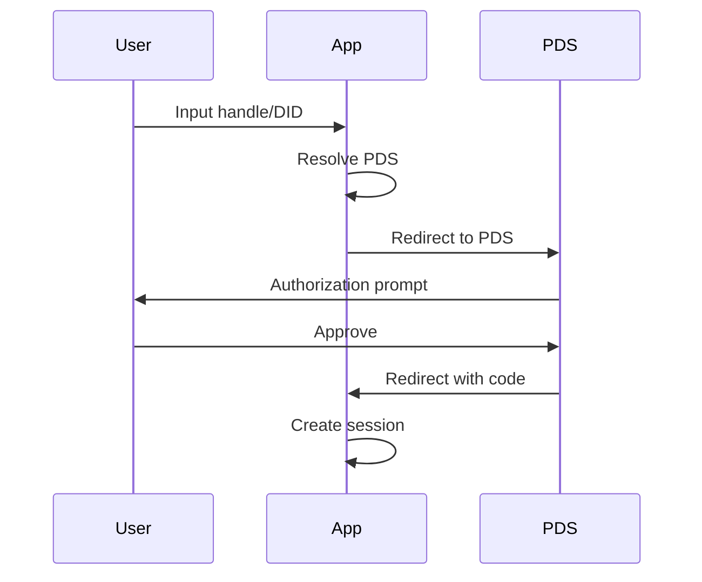

# OAuth

The AT Protocol supports the OAuth 2.0 authorization framework, allowing users to grant third-party applications access to their data without sharing their credentials. This section provides an overview of how OAuth works in the context of the AT Protocol and how developers can implement it in their applications.

## OAuth Flow

Generally, the OAuth flow consists of the following steps:

1. **User Input:** The user initiates the OAuth process by typing in their [handle](../identity/handle.md) or [DID](../identity/did.md) into the application and clicking the "Sign In" button.
2. **PDS Resolution:** The application resolves the user's [PDS (Personal Data Server)](../pds/index.md) using the provided handle or DID to determine where to send the authentication request.
3. **OAuth Redirection:** The application redirects the user to the PDS's OAuth authorization endpoint, where the user can grant permission for the application to access their data.
4. **OAuth Callback:** If the user approves the request, the PDS redirects the user back to the application with an authorization code.
5. **Session Creation:** The application exchanges the authorization code for a session.

If you are using a library for atproto, this means that by minimum, you will need to implement:
- The sign-in interface where the user can input their handle or DID
- A route in your application to handle the OAuth callback

