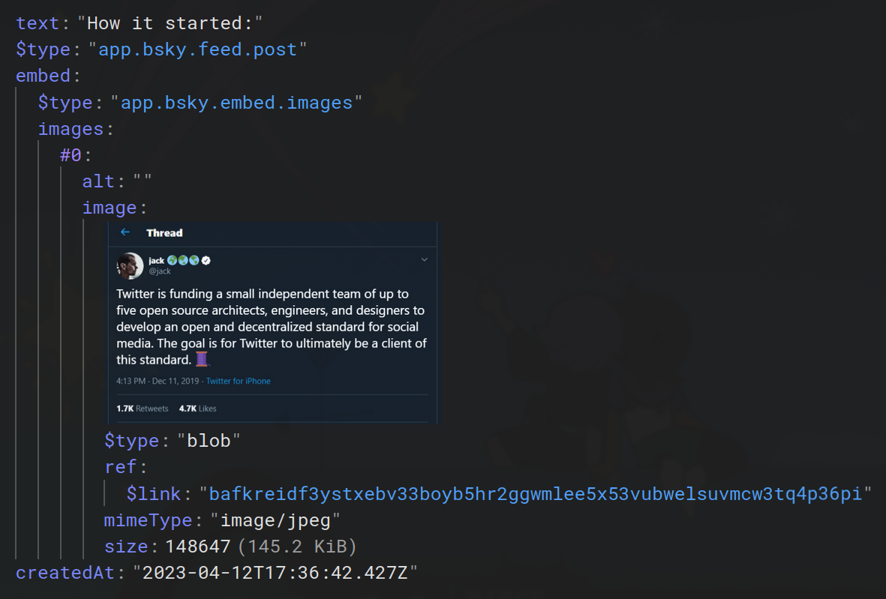

# Record

Records are the most primitive unit of data in the Atmosphere.

A Record is plainly put, simply, a **JSON object**.

Records are stored in a [Repo](../repo/index.md) and grouped by [Collections](../repo/collection.md). Each record has a **key** that is unique within its collection.

Records must have a `$type` property equal to the collection it is inside in. For example, a record in the `app.bsky.feed.post` collection must have a `$type` property with the value `app.bsky.feed.post`.

## Record Keys

Record keys can be any string, but they must be unique within their collection. They are used to identify and retrieve records from the repo.

By convention, record keys can be three types:

- [TIDs](#tids)
- [NSIDs](#nsids)
- [Literals](#literals)

### TID

The most common type of record key is a TID, which stands for "Timestamp ID". It's defined by the BlueSky team. A TID is a 64-bit integer encoded as a sortable base32 string. TIDs are generated by the client at the time of record creation, and they encode the timestamp of when the record was created. This allows for efficient sorting and retrieval of records based on their creation time. There's guaranteed to be no collisions with TIDs, as they are generated using a combination of the current timestamp and a random component.

Example TID: `3jzfcijpj2z2a`

### NSID

An NSID is "Namespaced Identifier". It's the same thing used for [Collection](../repo/collection.md) names.

### Literal

A literal key is any string that doesn't follow the TID or NSID format. Literal keys can be used for records that require a specific identifier that doesn't fit the TID or NSID patterns. For example, many "singletons" (collections that only have one record) use the literal key `self`.

## Validating Records

Records can be validated against a [Lexicon](../lexicon/index.md) to ensure they conform to the expected structure and data types. When creating or updating a record, the Application can ask the PDS to validate the record against a specific lexicon. If the record does not conform to the lexicon, the PDS will reject the operation and return an error.
